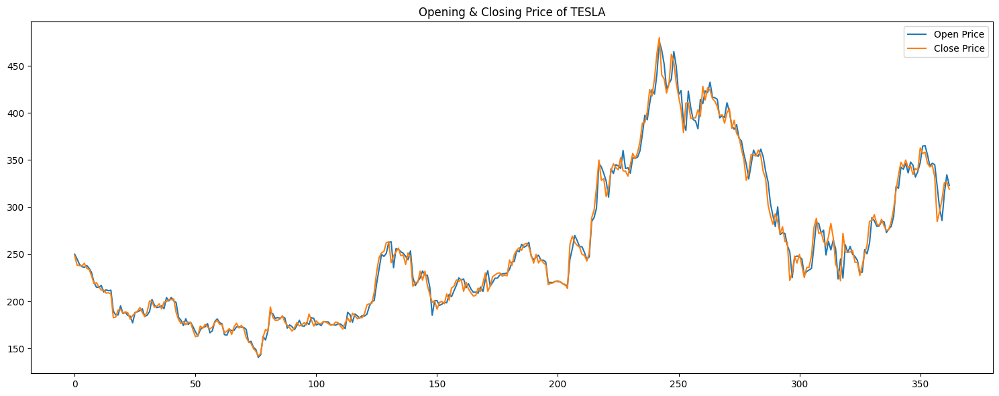
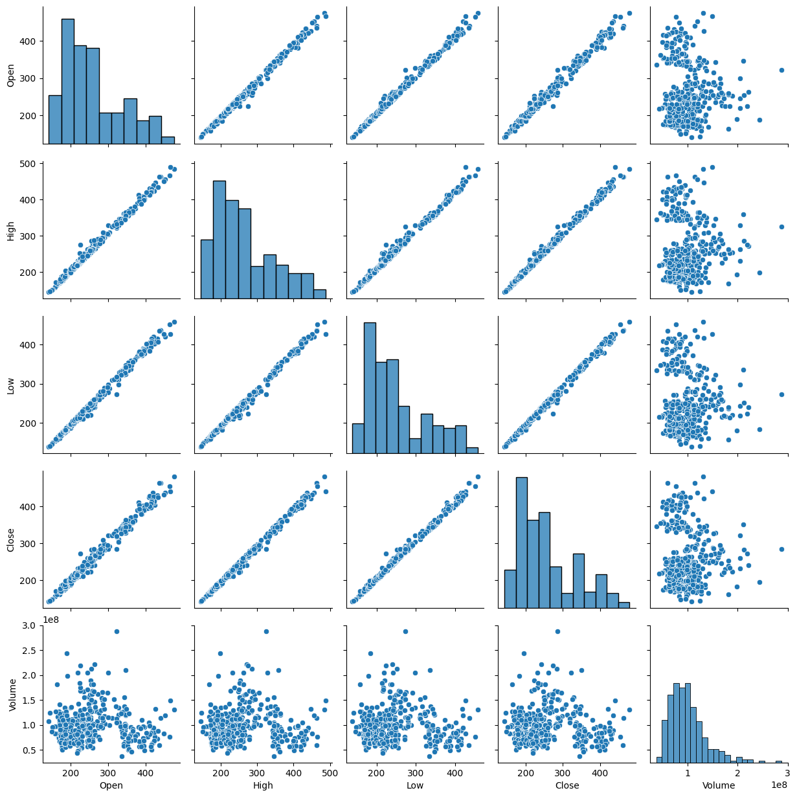
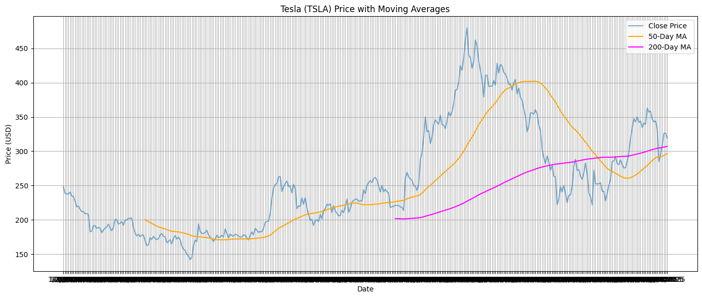
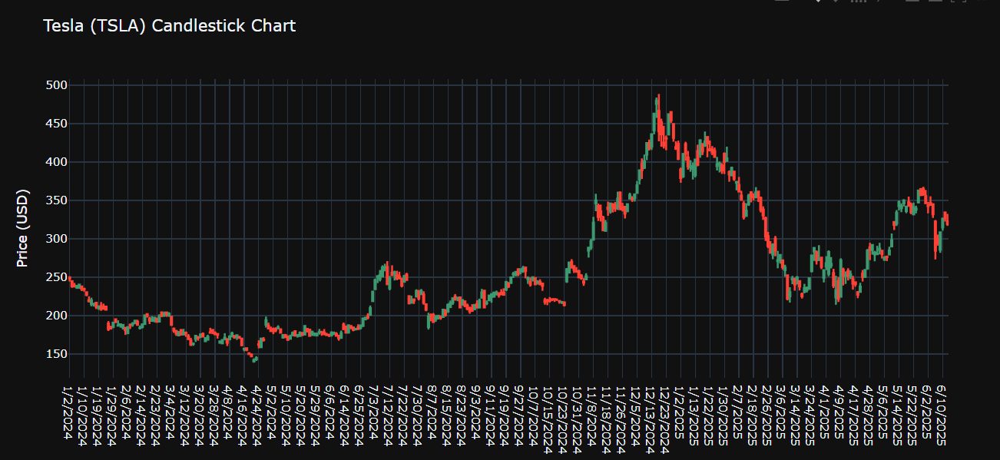
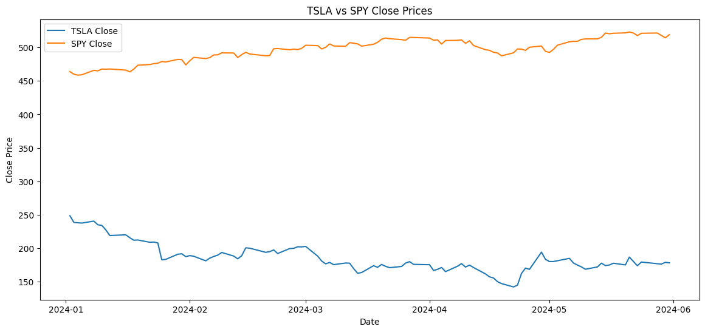
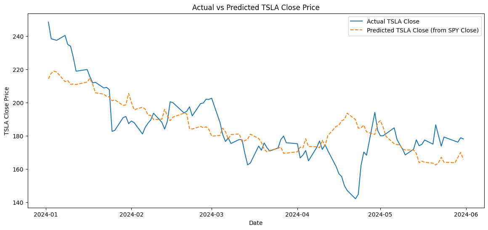
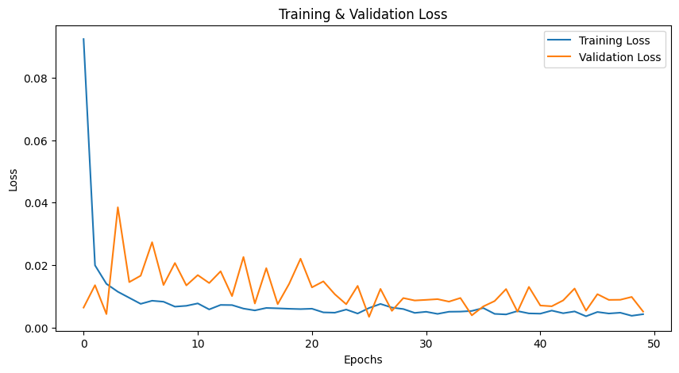

# 📈 Tesla Stock Price Prediction using Machine Learning and LSTM

## 🚀 Project Overview

In this research project, both **conventional regression** and **advanced deep learning algorithms** are employed to analyze and forecast the stock prices of **Tesla Inc. (TSLA)**. The data analysis process involves a blend of **exploratory data analysis**, **statistical learning**, and **time series modeling**.

To enhance the robustness of predictions, we incorporate **market-wide indicators**, specifically the **SPY ETF** a proxy for the S&P 500 index into the model. This inclusion helps capture broader **macroeconomic dynamics** that may influence Tesla's stock performance.

The final and most advanced model is built using a **Long Short-Term Memory (LSTM)** neural network, which is trained on historical TSLA data to forecast future prices based on learned temporal patterns.
This version is clear, formatted, and visually appealing for a technical audience reading your project

---

## 📊 Key Visualizations and Why They Matter

### 1. 📉 Line Plot of TSLA Closing & Opening Prices
- **Purpose:** Observe daily price fluctuations and overall trend.
- **Why:** Helps detect general direction and seasonal behavior.
  

### 2. 🔄 Pairplot
- **Purpose:** Understand correlation between variables (e.g., open, high, low, volume).
- **Why:** Highlights multicollinearity or redundancy.
  

### 3. 📈 50-day and 200-day Moving Averages
- **Purpose:** Identify medium and long-term trends.
- **Why:** Common indicators in technical analysis to detect momentum shifts or support/resistance zones.
  

### 4. 🕯️ Candlestick Chart using Plotly
- **Purpose:** Visualize daily market behavior in detail.
- **Why:** Offers granular insight into volatility and investor sentiment per trading day.
  

### 5. 🔗 Correlation Heatmap & Line Plot (TSLA vs SPY)
- **Purpose:** Compare Tesla with broader market trends (SPY ETF).
- **Why:** SPY serves as a proxy for macroeconomic behavior—Tesla does not exist in a vacuum. The observed correlation (R ≈ -0.70) justifies its inclusion as a predictive feature.


### 6. 🧠 Actual vs Predicted Prices
- **Purpose:** Visually assess model performance.
- **Why:** Ensures predictions follow realistic stock behavior without overshooting or underfitting.
 

### 7. 📉 Loss Curve (Training vs Validation)
- **Purpose:** Monitor overfitting during LSTM training.
- **Why:** Helps fine-tune model architecture and regularization.

---

## 🧠 Models Used

### 🔹 Linear Regression
- **Why:** Baseline model for understanding linear relationships between TSLA and SPY prices.
- **Pros:** Interpretable, fast, good starting point.
- **Cons:** Assumes linearity and fails on sequential dependencies.

### 🔹 LSTM (Long Short-Term Memory)
- **Why Chosen:** Financial time series have sequential dependencies and patterns that change over time. LSTM is capable of learning such **long-term temporal patterns** without needing feature engineering.
- **Advantages:**
  - Handles nonlinearities and trends
  - Excellent for sequence data
  - Learns from past 60-day windows to predict future prices

---

## 🔄 Why Include SPY ETF?

Tesla stock often correlates with broader market movements. By merging SPY (an index-tracking ETF for the S&P 500), we capture **market sentiment** and **systemic risk**, which could impact Tesla's price. This **macroeconomic context** improves model accuracy and real-world applicability.

---

## 🧪 Evaluation Metrics

- **Mean Squared Error (MSE)**
- **Root Mean Squared Error (RMSE)**
- **R² Score**
- **Visual inspection** (Actual vs Predicted plot)

These metrics offer insight into prediction error and model reliability.

---

## 📦 Dependencies

```bash
pip install numpy pandas matplotlib seaborn scikit-learn tensorflow yfinance plotly
